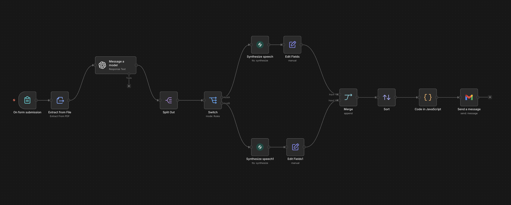

# PDF to Podcast

Upload any PDF and get a two-host podcast delivered to your inbox — built with n8n, OpenAI, and Smallest AI TTS.

Drop a PDF into a web form. OpenAI scripts a snappy back-and-forth dialogue between two hosts, Smallest AI synthesizes each turn in distinct voices, and the final audio file arrives in your email as a single `.wav`.

## How It Works



The workflow runs end-to-end without manual intervention:

1. **Form Trigger** — user uploads a PDF through an n8n-hosted web form
2. **Extract from File** — parses raw text out of the PDF
3. **Message a model (GPT-5)** — generates a structured podcast script with two hosts (Avery and Devansh) as a JSON array of turns, each tagged with `order`, `host` (`A` or `B`), and `text`
4. **Split Out** — explodes the `script` array into individual items, one per dialogue turn
5. **Switch** — routes each turn to the correct TTS node based on `host`
6. **Synthesize speech** (Host A — Avery) — synthesizes Host A's lines using Smallest AI TTS
7. **Synthesize speech1** (Host B — Devansh) — synthesizes Host B's lines using the `devansh` voice
8. **Edit Fields / Edit Fields1** — stamps `order` and `host` back onto each audio item so sequencing is preserved after parallel synthesis
9. **Merge** — reunites both audio streams into one list
10. **Sort** — re-orders all audio clips by `order` to restore the original dialogue sequence
11. **Code in JavaScript** — concatenates all WAV buffers into a single valid WAV file (`podcast.wav`)
12. **Send a message (Gmail)** — emails the finished podcast as an attachment

**Nodes used:**

| Node | Purpose |
|---|---|
| On form submission | Web form that accepts a PDF upload |
| Extract from File | Extracts text content from the uploaded PDF |
| Message a model (OpenAI) | Scripts the two-host podcast dialogue as structured JSON |
| Split Out | Splits the script array into individual dialogue turns |
| Switch | Routes turns to Host A or Host B TTS node |
| Synthesize speech | Smallest AI TTS for Host A (Avery, default voice) |
| Synthesize speech1 | Smallest AI TTS for Host B (Devansh, `devansh` voice) |
| Edit Fields / Edit Fields1 | Preserves `order` and `host` metadata after TTS |
| Merge | Combines both audio streams |
| Sort | Restores original dialogue order |
| Code in JavaScript | Concatenates WAV clips into one final audio file |
| Send a message (Gmail) | Emails the podcast WAV as an attachment |

## Prerequisites

- [n8n](https://n8n.io) instance (cloud or self-hosted)
- [Smallest AI](https://console.smallest.ai) account and API key
- [OpenAI](https://platform.openai.com) account and API key
- Gmail account connected to n8n via OAuth2

## Getting Started

### 1. Install the Smallest AI community node

In your n8n instance go to **Settings → Community Nodes → Install** and search for:

```
n8n-nodes-smallestai
```

For self-hosted instances you can also run:

```bash
npm install n8n-nodes-smallestai
```

> Requires n8n v1.x or v2.x and Node.js v22+.

### 2. Set up credentials

You need three sets of credentials in n8n (**Credentials → New**):

**Smallest AI**
1. Go to [console.smallest.ai](https://console.smallest.ai) → **Settings → API Keys**
2. Click **Create API Key**, copy it
3. In n8n: **Credentials → New → Smallest.ai API**, paste the key and save

**OpenAI**
1. Go to [platform.openai.com/api-keys](https://platform.openai.com/api-keys) → **Create new secret key**
2. In n8n: **Credentials → New → OpenAI API**, paste the key and save

**Gmail**
1. In n8n: **Credentials → New → Gmail OAuth2**
2. Follow the OAuth flow to connect your Google account

### 3. Import the workflow

1. Open your n8n instance
2. Go to **Workflows → New**
3. Click the **...** menu → **Import from File** (or paste JSON via **Import from JSON**)
4. Select [workflow.json](./workflow.json) from this folder

### 4. Update credentials and email address

After importing, each node that uses credentials will show a warning. Click each highlighted node and select your saved credentials:

| Node | Credential |
|---|---|
| Synthesize speech | Smallest.ai account |
| Synthesize speech1 | Smallest.ai account |
| Message a model | OpenAI account |
| Send a message | Gmail account |

Also open the **Send a message** node and update the `sendTo` field to your own email address.

### 5. Activate and use

Click **Activate** (toggle in the top right). n8n will display the form URL — open it, upload a PDF, and submit. When the workflow finishes, the podcast will arrive in your inbox as `podcast.wav`.

## Customization

**Change the TTS voices**

- Open **Synthesize speech** (Host A) and set a different `voiceId` for Avery's voice
- Open **Synthesize speech1** (Host B) and change `voiceId` from `devansh` to any other voice

Available voices include `sophia`, `robert`, `advika`, `vivaan`, `aisha`, `devansh`, and more. See the [Smallest AI docs](https://docs.smallest.ai) for the full list.

**Change the podcast format**

Edit the system prompt inside the **Message a model** node to adjust the tone, length, number of hosts, or dialogue style. The output schema (`order`, `host`, `text`) must stay consistent for the downstream nodes to work correctly.

**Change the AI model**

Open the **Message a model** node and swap `gpt-5` for any model available in your OpenAI account that supports structured output / JSON schema mode.
