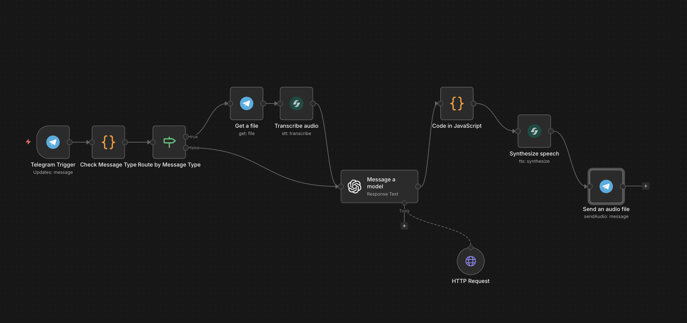
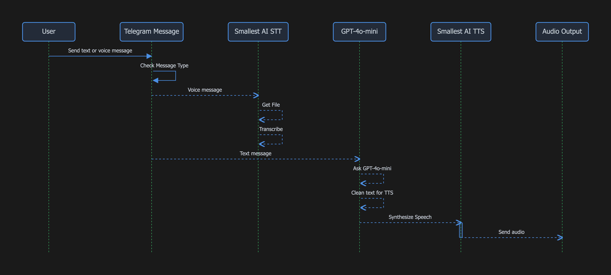

# Telegram Hacker News Agent

A Telegram bot that fetches live Hacker News stories and responds with synthesized audio — built with n8n, Smallest AI, and OpenAI.

Send a text or voice message to your bot asking about tech news. It fetches the top Hacker News stories in real time, generates a spoken response using Smallest AI TTS, and sends the audio back to you in Telegram.

## How It Works



The workflow handles both text and voice input, routes them through Hacker News fetching + AI summarization, then synthesizes and returns an audio reply:



**Nodes used:**
| Node | Purpose |
|---|---|
| Telegram Trigger | Receives incoming messages |
| Check Message Type (Code) | Detects whether the message is voice or text |
| Route by Message Type (If) | Branches the flow accordingly |
| Telegram — Get a file | Downloads the voice file by file ID |
| Smallest AI — Transcribe audio | Transcribes the voice message to text via STT |
| OpenAI — Message a model | Queries GPT-4o-mini with HN context + HTTP tool |
| HTTP Request (Tool) | Fetches live data from the Hacker News Firebase API |
| Code in JavaScript | Strips markdown/emojis from AI response for clean TTS input |
| Smallest AI — Synthesize speech | Converts the clean text to audio (voice: `aisha`, speed: `0.8`) |
| Telegram — Send an audio file | Sends the generated audio back to the user |

## Prerequisites

- [n8n](https://n8n.io) instance (cloud or self-hosted)
- [Smallest AI](https://console.smallest.ai) account and API key
- [OpenAI](https://platform.openai.com) account and API key
- A Telegram bot token (create one via [@BotFather](https://t.me/BotFather))

## Getting Started

### 1. Install the Smallest AI community node

In your n8n instance go to **Settings → Community Nodes → Install** and search for:

```
n8n-nodes-smallestai
```

For self-hosted instances you can also run:

```bash
npm install n8n-nodes-smallestai
```

> Requires n8n v1.x or v2.x and Node.js v22+.

### 2. Set up credentials

You need three sets of credentials in n8n (**Credentials → New**):

**Smallest AI**
1. Go to [console.smallest.ai](https://console.smallest.ai) → **Settings → API Keys**
2. Click **Create API Key**, copy it
3. In n8n: **Credentials → New → Smallest.ai API**, paste the key and save

**Telegram**
1. Message [@BotFather](https://t.me/BotFather) on Telegram → `/newbot`
2. Copy the bot token
3. In n8n: **Credentials → New → Telegram API**, paste the token and save

**OpenAI**
1. Go to [platform.openai.com/api-keys](https://platform.openai.com/api-keys) → **Create new secret key**
2. In n8n: **Credentials → New → OpenAI API**, paste the key and save

### 3. Import the workflow

1. Open your n8n instance
2. Go to **Workflows → New**
3. Click the **...** menu → **Import from File** (or paste JSON via **Import from JSON**)
4. Select [workflow.json](./workflow.json) from this folder

### 4. Update credentials in the workflow

After importing, each node that uses credentials will show a warning. Click each highlighted node and select your saved credentials:

| Node | Credential |
|---|---|
| Telegram Trigger | Telegram account |
| Get a file | Telegram account |
| Send an audio file | Telegram account |
| Transcribe audio | Smallest.ai account |
| Synthesize speech | Smallest.ai account |
| Message a model | OpenAI account |

### 5. Activate the workflow

Click **Activate** (toggle in the top right). Your Telegram bot is now live.

Send your bot a message like:

- `"What's trending on Hacker News?"`
- `"Any AI news today?"`
- Or send a **voice message** asking the same — it will be transcribed first

The bot will fetch live HN stories, summarize them, and reply with a synthesized audio message.

## Customization

**Change the TTS voice**

Open the **Synthesize speech** node and update the `voiceId` field. Available voices include `sophia`, `robert`, `advika`, `vivaan`, `aisha`, and 80+ more. See the [Smallest AI docs](https://docs.smallest.ai) for the full list.

**Change the AI model**

Open the **Message a model** node and swap `gpt-4o-mini` for any model available in your OpenAI account.

**Adjust TTS speed**

In the **Synthesize speech** node, under **Additional Options**, change `speed` (range: `0.5`–`2.0`).
