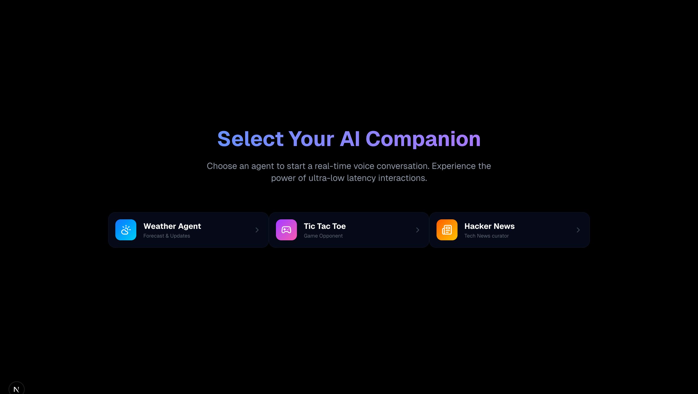
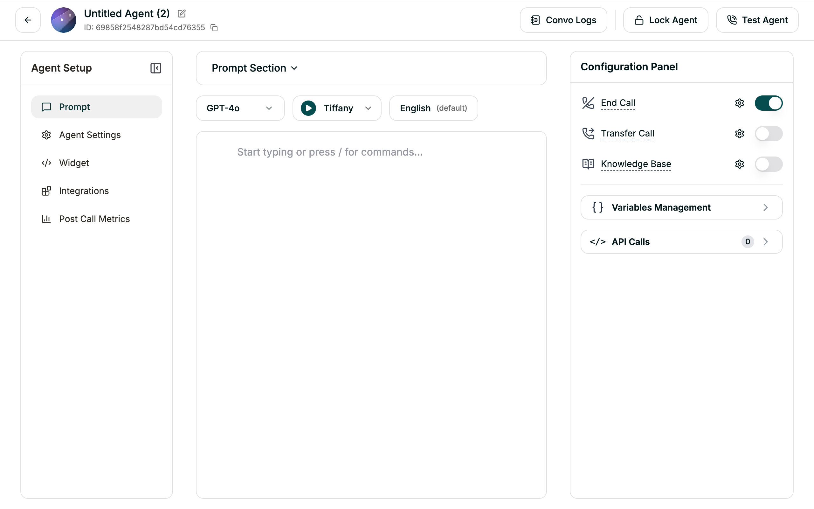

# Multi-Agent Voice AI Dashboard

A real-time, multi-agent voice AI dashboard powered by **Smallest.ai Atoms SDK** and **Next.js**. It features high-performance voice interactions with specialized agents for gaming and utility.

[](https://agent-smallest-ai.vercel.app/)

## Getting Started

### 1. Create your Agents
First, you need to set up your voice agents on the Smallest.ai platform:
1. Visit [Smallest.ai Atoms](https://atoms.smallest.ai/).
2. Create three agents: one for Weather, one for Tic-Tac-Toe, and one for Hacker News.
3. Configure their voices, system prompts, and tools as detailed in the [`agents-config`](./agents-config) folder. Each agent requires specific tool definitions (API calls, parameters, and query mappings) to function correctly.



### 2. Prerequisites
- Node.js (v20+)
- A Smallest.ai API Key

### 3. Installation
```bash
git clone https://github.com/smallest-ai/smallestai-cookbook.git
cd smallestai-cookbook/voice-agents/atoms_sdk_web_agent
npm install
```

### 4. Environment Setup
Create a `.env.local` file in the root directory:
```env
# Smallest.ai API Key
SMALLESTAI_API_KEY=your_api_key_here

# Agent IDs from Smallest.ai dashboard
TICTACTOE_AGENT_ID=your_tictactoe_agent_id
WEATHER_AGENT_ID=your_weather_agent_id
HACKERNEWS_AGENT_ID=your_hackernews_agent_id
```
> **Note:** The `TICTACTOE_AGENT_ID`, `WEATHER_AGENT_ID`, and `HACKERNEWS_AGENT_ID` are the unique IDs for the agents you created in Step 1.

### 5. Run Locally
```bash
npm run dev
```
Open [http://localhost:3000](http://localhost:3000).

## Smallest.ai Dashboard Configuration

### Tic-Tac-Toe Agent Tools
Configure these tools in your Smallest.ai dashboard for the Tic-Tac-Toe agent:

#### Tool: `new_game`
- **Method:** `POST`
- **URL:** [`/api/tictactoe/new-game`](./app/api/tictactoe/new-game/route.ts)

#### Tool: `make_move`
- **Method:** `POST`
- **URL:** [`/api/tictactoe/make-move`](./app/api/tictactoe/make-move/route.ts)
- **Parameters:** `gameId` (String), `position` (Number, 0-8)

#### Tool: `get_state`
- **Method:** `GET`
- **URL:** [`/api/tictactoe/get-state`](./app/api/tictactoe/get-state/route.ts)
- **Parameters:** `gameId` (String)

### Hacker News Agent Tools
Configure this tool in your Smallest.ai dashboard for the Hacker News agent:

#### Tool: `get_top_stories`
- **Method:** `GET`
- **URL:** [`/api/hackernews/top`](./app/api/hackernews/top/route.ts)

## Deployment

This project is optimized for deployment on **Vercel**:

1. Push your code to a GitHub repository.
2. Link the repository to a new project on Vercel.
3. Add your Environment Variables in the Vercel Dashboard.

## License
MIT License. Feel free to use and modify for your own voice-enabled applications!