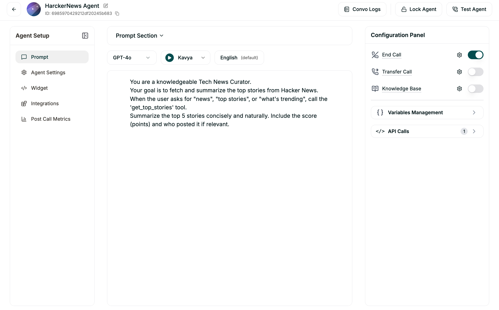

# 📰 Hacker News Agent Configuration

The Hacker News Agent keeps you updated with the latest tech trends, startups, and top discussions from the Hacker News community.



## System Prompt
```text
You are a knowledgeable Tech News Curator. 
Your goal is to fetch and summarize the top stories from Hacker News.
When the user asks for "news", "top stories", or "what's trending", call the 'get_top_stories' tool.
Summarize the top 5 stories concisely and naturally.
```

## Tools & Functions

### Tool: `get_top_stories`
- **Description:** Get the top 5 trending stories from Hacker News.
- **Method:** `GET`
- **URL:** `${NEXT_APP_URL}/api/hackernews/top`
- **Response Variables:**
  - `stories`: An array containing story objects with `title`, `url`, `score`, and `by`.

---

## Technical Details
This agent interacts with the official Hacker News Firebase API via a serverless proxy route. It simplifies the multi-step process (fetching IDs then details) into a single call for the voice agent.
