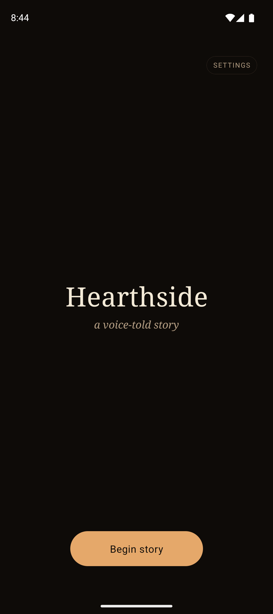

# Hearthside — a voice-told story on Smallest Atoms

A minimal React Native (Expo) sample that opens a real-time voice session with a Smallest Atoms agent and lets the listener steer a short branching Victorian mystery with their voice. Built on the plain WebSocket protocol documented at [docs.smallest.ai/atoms/developer-guide/integrate/mobile/react-native](https://docs.smallest.ai/atoms/developer-guide/integrate/mobile/react-native).

<p align="center"></p>

The app is deliberately small so it reads as a reference for anyone wiring an Atoms agent into their own mobile app.

## What it shows

- Real-time voice session over `wss://api.smallest.ai/atoms/v1/agent/connect` using the built-in `WebSocket` global (no SDK).
- Microphone capture and gapless PCM playback using [`react-native-audio-api`](https://docs.swmansion.com/react-native-audio-api/).
- Full protocol: `input_audio_buffer.append` streaming, `output_audio.delta` scheduled playback, `agent_start_talking` / `agent_stop_talking` / `interruption` / `session.closed` handling.
- Exponential-backoff reconnect for transient drops, hard-stop on auth failures.
- Programmatic agent creation and in-app reconfiguration via REST — voice, speed, and language pickers that drive the full `draft → publish → activate` flow.
- Transport diagnostics in the UI: a live chunk counter so users can verify their voice is actually reaching the server.
- Mute toggle to suppress mic uploads during narration (stops spurious server-side VAD interruptions).
- Correctly configured iOS audio session: `playAndRecord` + `default` mode + `defaultToSpeaker`, so narration plays through the loud bottom speaker at full media volume, cleanly, without distortion or buffer underruns.

## Prerequisites

- **Node** 20+
- **Python** 3.10+ (for the one-time setup script)
- **Xcode** 26 or newer for iOS builds, or **Android Studio** with SDK 34+ for Android builds
- A Smallest AI account and an API key from [app.smallest.ai/dashboard/api-keys](https://app.smallest.ai/dashboard/api-keys)

## Setup

Two paths depending on whether you want the app to create the agent for you or you already have one.

### A. Let the script create the narrator agent

```bash
cd voice-agents/react_native_voice_agent

cp .env.example .env
# paste your SMALLEST_API_KEY into .env

python3 scripts/setup_agent.py       # creates (or updates) the narrator, writes AGENT_ID to .env
npm install
npx expo prebuild --clean            # regenerates ios/ and android/ projects
```

`scripts/setup_agent.py` walks the full REST flow behind the scenes: `POST /agent` → open a draft → `PATCH /drafts/.../config` with the prompt, voice, and LLM model → `POST /drafts/.../publish` → `PATCH /versions/.../activate`. It is idempotent — re-running updates the existing agent in place instead of creating duplicates.

Flags:

```bash
python3 scripts/setup_agent.py --voice magnus        # different voice
python3 scripts/setup_agent.py --model electron      # different LLM (electron or gpt-4o)
python3 scripts/setup_agent.py --name "Mystery Narrator"
python3 scripts/setup_agent.py --force-create       # ignore existing AGENT_ID in .env
```

### B. Use an agent you already built in the dashboard

```bash
cd voice-agents/react_native_voice_agent

cp .env.example .env
# paste SMALLEST_API_KEY and AGENT_ID into .env

python3 scripts/setup_agent.py       # sees AGENT_ID present, verifies, exits
npm install
npx expo prebuild --clean
```

The script detects that `AGENT_ID` is already set and exits without calling any write APIs. Use this path when you already tuned the narrator persona in the dashboard and just want to wire the mobile client up to it.

## Run

**iOS** (simulator or device):

```bash
npx expo run:ios               # simulator
npx expo run:ios --device      # physical iPhone over USB
```

**Android** (emulator or device):

```bash
npx expo run:android
```

On first launch the app requests microphone permission. Tap **Begin story**. The narrator greets you and begins the opening scene. Speak your choice when it pauses. Tap **End story** to finish.

### In-app settings

Tap **settings** (top-right, idle screen only) to open the agent configuration sheet:

- **Voice** — pick from six curated `lightning-v3.1` voices, or the custom chip shows the currently-active voice (e.g. your own clone).
- **Speed** — 0.85× / 1.00× / 1.15× / 1.30×.
- **Language** — English, Hindi, or Multi (auto-detect).

**Apply & publish** runs the five-step REST flow (open draft → PATCH config → publish version → activate version) against your live agent. End the current story and start a new one to hear the change.

### During a session

- **mute / unmute** pill under the *you* waveform — gates the mic-upload path client-side. Muted = zero chunks leave the phone. Useful during long narration when your room has background noise.
- **sending · N** counter — increments per 20 ms outbound audio chunk (~50/sec). If the number climbs, transport is alive regardless of what your mic is actually capturing.

## How it works

| Layer | Module | Responsibility |
|---|---|---|
| Transport | `src/agent/AtomsClient.ts` | Opens the WebSocket, dispatches server events, handles reconnect with backoff. |
| REST | `src/agent/atomsRest.ts` | Thin `fetch` wrapper for the agent read + draft-publish-activate flow used by the settings sheet. |
| Capture | `src/agent/audioCapture.ts` | Configures the iOS audio session (`playAndRecord` + `default` + `defaultToSpeaker`), starts an `AudioRecorder`, converts Float32 → Int16 LE, emits RMS for the mic waveform. |
| Playback | `src/agent/audioPlayback.ts` | Web Audio `AudioContext` with a `nextPlayTime` pointer for gapless scheduling; `ctx.resume()` after construction (Android starts suspended); `flush()` resets the pointer on `interruption`. |
| State machine | `src/hooks/useAtomsSession.ts` | `idle → connecting → joined → listening → narrating → error`. Owns permission check, lifecycle, mute gating, mic-chunk counter, error classification. |
| UI | `app/index.tsx` + `src/ui/*` | Single screen. Title card, status chip, two labelled waveforms (narrator + you), mute pill, send counter, settings sheet, call button, error banner. |

## iOS audio routing

Choosing the iOS audio session for a voice agent is a three-way trade-off between output volume, playback stability, and hardware echo cancellation. We picked `default`. Reasoning, briefly:

- `voiceChat` / `videoChat` — hardware AEC and noise suppression are great, but iOS routes output through the phone-call audio path. That means output caps at ~50% media volume and plays through the **receiver near the top notch**, not the loud bottom speaker. Apple's docs are explicit that `defaultToSpeaker` is silently ignored in these modes.
- `voicePrompt` — routes to the loud speaker and keeps AEC, but the underlying audio unit is tuned for **short** Siri-style prompts. When we feed it continuous 24 kHz streaming audio for minutes, its buffer queue underruns and the output distorts (muffled, buzzy, choppy).
- `default` — no voice-processing audio unit. Stable continuous playback at full media volume on the loud speaker when `defaultToSpeaker` is set. The absence of hardware AEC means the speaker can echo back into the mic on a hands-free demo, but the mute button and headphone use both kill that loop cleanly.

For a storytelling app with long-running playback, `default` is the right pick. For a full-duplex conversational app where speaker use is the norm, revisit and consider enabling `voiceChat` with an explicit `overrideOutputAudioPort(.speaker)` call at the native layer.

## Known limitations

- **iOS simulator distorts audio.** The Xcode simulator bridges iOS audio through macOS CoreAudio with aggressive resampling at 48 kHz, which produces radio-like crackling on 24 kHz streams. This is an Apple simulator limitation that every RN voice-agent app hits. The same code runs cleanly on a physical iPhone. Validate audio quality on device, not simulator.
- **Android emulator virtual microphone.** The emulator records silence by default. The *sending · N* counter still climbs (transport works) but the server hears zero audio. Enable *Extended Controls → Microphone → Virtual microphone uses host audio input*, or test on a physical device.
- **Android emulator audio output on Apple Silicon.** qemu's CoreAudio routing binds the output to whatever device was active at emulator boot. If you plug in headphones mid-session you need to restart the emulator — the built-in speaker path doesn't re-route automatically. Real Android devices are fine.
- **Background mode.** The session tears down on actual app backgrounding. Notification shade, Control Center, and brief system dialogs keep the session alive. Keeping the socket open across a full suspension needs a foreground service on Android and VoIP entitlements on iOS, neither of which is in scope for a cookbook demo.
- **Curated voice list.** The settings sheet ships with six shortlisted voices to keep the picker readable. The full `lightning-v3.1` catalogue is 106 voices; if you want the complete list, fetch `GET /waves/v1/voices` at runtime.

## Reference

- [Realtime Agent WebSocket API](https://docs.smallest.ai/atoms/api-reference/api-reference/realtime-agent/realtime-agent) — full event protocol.
- [React Native integration guide](https://docs.smallest.ai/atoms/developer-guide/integrate/mobile/react-native) — the validated stack this app uses.
- [`react-native-audio-api`](https://github.com/software-mansion/react-native-audio-api) — the underlying audio library.
