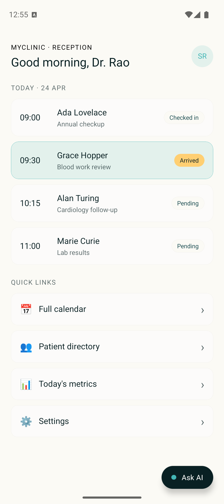

# Atoms Voice Widget (React Native)

A drop-in voice-agent widget for existing React Native apps. Adds a floating **Ask AI** pill in the corner; tapping it opens a bottom sheet with a live voice session (transcript, status, waveform, mic button). The host app keeps rendering underneath — this is not a full-screen takeover.

<p align="center">
  
  
</p>

The sample **host app** is a made-up clinic receptionist dashboard (MyClinic). Swap it for your own screen; the widget is independent.

## Drop it into your app (one component)

```tsx
import { AtomsWidget } from '@/widget/AtomsWidget';

export default function YourScreen() {
  return (
    <View style={{ flex: 1 }}>
      {/* ...your existing app content... */}
      <AtomsWidget apiKey={API_KEY} agentId={AGENT_ID} label="Ask AI" />
    </View>
  );
}
```

The widget renders a floating pill in the bottom-right and manages everything else — session lifecycle, mic permission, audio capture + playback, transcript, error handling. Two props only (`apiKey`, `agentId`); the optional `label` customizes the pill text.

## What's inside

| Piece | File | Role |
|---|---|---|
| Public component | `src/widget/AtomsWidget.tsx` | FAB pill + session orchestration. Consumers only see this. |
| Bottom sheet shell | `src/widget/WidgetSheet.tsx` | Modal-based bottom sheet with slide+fade animation. No external sheet library. |
| Transcript list | `src/widget/Transcript.tsx` | User/assistant rows, populated from server `transcript` events. |
| Status line | `src/widget/StatusLine.tsx` | Dot + label (Connecting / Listening / Speaking / Error). |
| Waveform | `src/widget/Waveform.tsx` | 9-bar animated VU meter, center-weighted envelope. |
| Action row | `src/widget/ActionRow.tsx` + `MicButton.tsx` | Keyboard + mic + close. Mic has a pulsing halo when active. |
| Transport | `src/agent/AtomsClient.ts` | WSS client with exponential-backoff reconnect + auth hard-stop. |
| Audio | `src/agent/audioCapture.ts`, `audioPlayback.ts` | Mic tap + gapless PCM playback via `react-native-audio-api`. |
| State | `src/hooks/useAtomsSession.ts` | Session state machine + mic-chunk counter + mute gate. |
| Theme | `src/theme/colors.ts`, `typography.ts` | Smallest brand palette (teal, cream, coral, near-black). |

## Prerequisites

- **Node** 20+
- **Python** 3.10+ (for the agent-setup script)
- **Xcode** 15+ for iOS builds, or **Android Studio** with SDK 34+ for Android
- A Smallest AI account and API key from [app.smallest.ai/dashboard/api-keys](https://app.smallest.ai/dashboard/api-keys)

## Setup

```bash
cd voice-agents/react_native_voice_widget

# 1. Install JS deps
npm install

# 2. Create the MyClinic Receptionist agent (or reuse your own).
cp .env.example .env
# paste your SMALLEST_API_KEY into .env
python3 scripts/setup_agent.py
# → writes EXPO_PUBLIC_AGENT_ID back to .env automatically

# 3. Regenerate native projects + build
npx expo prebuild --clean
```

The setup script is idempotent — re-running updates the agent in place instead of creating duplicates. Flags (`--voice`, `--model`, `--name`, `--force-create`) work the same as in the Hearthside cookbook.

## Run

### Android (emulator or phone)

```bash
npx expo run:android
```

On the **Pixel emulator**, to get the virtual mic to pick up your Mac's real mic: click the `⋯` icon → **Microphone** → toggle *Virtual microphone uses host audio input* **ON**. Otherwise chunks stream but every sample is silence.

### iOS simulator

```bash
npx expo run:ios
```

The simulator works for UI and flow testing but **audio comes out distorted** because of the macOS CoreAudio resampler. This is an Apple simulator limitation — every RN voice app hits it.

### iOS physical device

```bash
npx expo run:ios --device
```

`expo` will list the plugged-in devices; pick yours. First run asks for a development Team in Xcode (Personal Team is fine) and a **Trust this computer** tap on the phone. After the first successful install the same command redeploys in seconds.

Real-device caveats:
- Keep the iPhone **unlocked** and trusted — otherwise it shows `unavailable` in `devicectl list devices`.
- After a Metro restart, shake the phone → **Reload** to pick up the new JS bundle.
- Speaker audio may be quiet until you turn device volume up; iOS throttles unknown apps at first launch.

## Testing the demo

With everything installed, tap **Ask AI** on the host screen. The agent greets Dr. Rao and switches to the **Listening** state. Try:

- *"What's on my schedule today?"* — the agent should read the four patients on the dashboard in order
- *"When is Grace Hopper?"* — *"9:30, blood work review"*
- *"Reschedule Alan Turing to 2 p.m."* — agent repeats the name + new time before confirming
- *"Is aspirin safe during pregnancy?"* — agent politely declines (clinical question, not for the front desk)

All four are wired into the agent's system prompt (`scripts/setup_agent.py`) so you can audit or tweak the scope.

## Customizing

### Change the agent persona

Open `scripts/setup_agent.py`, edit `NARRATOR_PROMPT` (the constant is legacy-named from the Hearthside template), re-run the script. The new version ships live immediately — no rebuild needed, just reload the widget on next open.

### Change the theme

Brand palette lives in `src/theme/colors.ts`. The widget reads from this file only; swap any hex and the whole component re-skins. Component-level spacing is in each component's `StyleSheet`.

### Change the pill copy / position

```tsx
<AtomsWidget label="Talk to us" apiKey={K} agentId={I} />
```

For a different corner, edit `pillContainer` in `AtomsWidget.tsx` (absolute positioning, 4 lines).

### Add a chat-mode toggle

The server accepts `mode=chat` as an alternative to `mode=webcall` — text in, text out, no audio. Pass it through `AtomsClient` constructor and branch the UI on a prop. ~40 lines of diff.

## How the floating pill stays over your app

`<AtomsWidget>` renders two siblings:

1. A `<View style={position: 'absolute', right: 20, bottom: 28}>` with `pointerEvents="box-none"` — the pill sits above everything but doesn't block taps on the rest of the screen.
2. A `<Modal>` for the sheet that only appears when the user taps the pill.

Drop the component at the **root of your screen tree** (not inside a scrollview) so it overlays every pixel of your layout.

## Known limitations

- **iOS simulator audio is distorted.** Validate quality on a physical iPhone.
- **Android emulator mic is silent** without the host-audio-input toggle. Real Android device is fine.
- **Backgrounding tears the session down.** This is intentional for a demo — a production widget needs VoIP entitlements on iOS and a foreground service on Android, neither of which are in scope here.
- **Transcript rows only appear if the server emits `transcript` events.** Most Atoms agents do by default; if yours doesn't you'll see the empty-state placeholder. The status + waveform are still live.
- **No keyboard / text input** yet — the keyboard icon in the action row is a stub. The server supports `input_text.send` for chat-mode; wiring it up is ~30 lines.

## Reference

- [Realtime Agent WebSocket API](https://docs.smallest.ai/atoms/api-reference/api-reference/realtime-agent/realtime-agent) — full wire protocol.
- [React Native integration guide](https://docs.smallest.ai/atoms/developer-guide/integrate/mobile/react-native) — the drop-in code samples that this widget composes.
- [Hearthside (RN voice agent cookbook)](../react_native_voice_agent/) — the same engine rendered as a full-screen storytelling app, with an in-app settings sheet for voice/speed/language.
